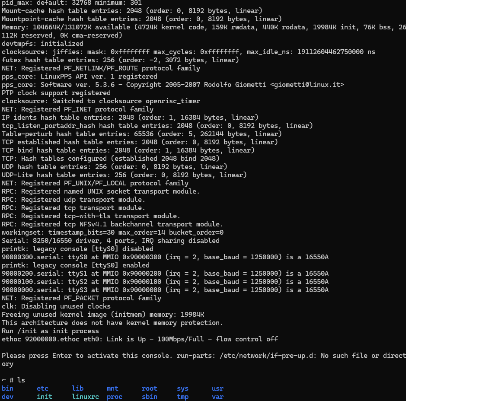
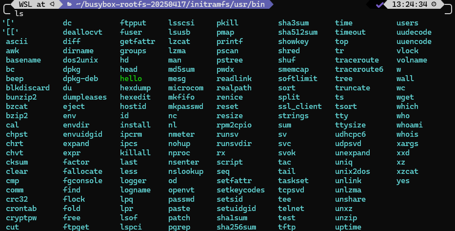
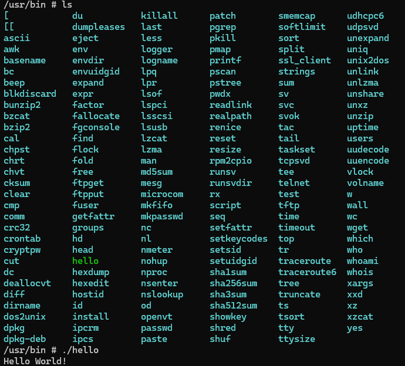

The objective of this tutorial is to run a Hello World program on QEMU. The prerequisite is to have a [cross-compiler](https://openrisc.io/software) for OpenRISC 1000 (or1k). And don't forget to add it to the `PATH` .

# Intro
QEMU is a generic emulator that supports various target architectures. [It can be used to emulate a 32-bit OpenRISC CPU](https://www.qemu.org/docs/master/system/target-openrisc.html).\
QEMU has two different modes of emulation: user mode and system emulation mode. The user mode only allows you to run programs compiled for the target architecture, while the system mode emulates the complete hardware. 

# User Mode
## Install QEMU
Install the pre-built package from your distribution's package manager. On Ubuntu, run\
`sudo apt install qemu-user-static`  
for running statically linked binaries OR\
`sudo apt install qemu-user`  
for running dynamically linked binaries. Personally, I am using the static version for this tutorial.

## Cross-compile the Program
`hello.c` is included in this directory. Compile it using the cross-compiler you have. For me, the command is\
`or1k-none-linux-musl-gcc hello.c -static -o hello`.

And check if the output file type looks correct using `file` command.
```
file hello
hello: ELF 32-bit MSB executable, OpenRISC, version 1 (SYSV), statically linked, with debug_info, not stripped
```

Note that `-static` flag was used when compiling. Without this, the output will be a dynamically linked ELF, which will give an error, ```qemu-or1k-static: Could not open '/lib/ld-musl-or1k.so.1': No such file or directory```, if we try to run it using `qemu-or1k-static`.

## Run the program
```
qemu-or1k-static hello
```
If the output is `Hello World!`, then everything is working correctly.

# System Emulation
To run this mode, you need a [rootfs](https://github.com/stffrdhrn/or1k-rootfs-build/releases) and build the Linux kernel with it. See [Linux Openrisc](https://www.kernel.org/doc/html/v5.11/openrisc/openrisc_port.html) for the instructions. Once the kernel is built, you will see `vmlinux` file in the root directory. Running `file vmlinux` should give you the following output:
```
vmlinux: ELF 32-bit MSB executable, OpenRISC, version 1 (SYSV), statically linked, BuildID[sha1]=..., with debug_info, not stripped
```
Make sure it is an ELF file for OpenRISC, not your host system. If that happened, it means the kernel was built using a wrong toolchain (host system's toolchain).

## Install QEMU
Install the pre-built package from your distribution's package manager. On Ubuntu, run\
`sudo apt install qemu-system` 

## Running QEMU
Now that we have all the components we need, we can run QEMU like so:
```
qemu-system-or1k -cpu or1200 -M or1k-sim -kernel <path-to-your-vmlinux> -serial stdio -nographic -monitor none
```

Read the output generated and see if everything looks alright, but don't be alarmed if you see `Initial ramdisk not found` somewhere in there. It is because we did not explicitly pass one to QEMU using `-initrd` flag. This is okay, because we have it baked in inside the kernel and kernel uses that when it boots up. As long as the last line says `Please press Enter to activate this console` and you can see the basic file system inside the QEMU instance, it is all good.


If you want to learn more about QEMU invocation options, please visit [this page](https://www.qemu.org/docs/master/system/invocation.html). OpenRISC-specific QEMU information can be found in this [Wiki page](https://wiki.qemu.org/Documentation/Platforms/OpenRISC). 

One thing you will notice once you get to this stage is that you cannot write a C program and compile it inside QEMU, because there is no compiler.
  
## How to Run a Program
For this tutorial, we will use the simplest method of embedding our `hello` binary in the initramfs, so that when QEMU boots, the binary is already there to run. I put it in `<path-to-initramfs>/usr/bin` and re-compiled the kernel with it.

Start a QEMU instance with the new kernel and run the `hello` binary.


Please note that this method is not scalable/sustainable and using [SSH](https://wiki.qemu.org/Documentation/Networking), although it is more complicated to set up with QEMU, is recommended. 
